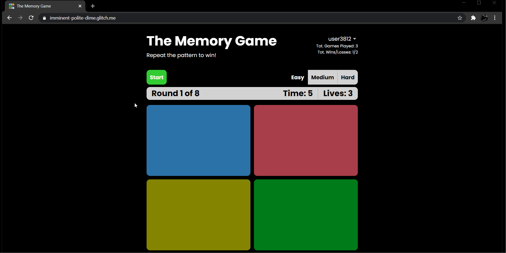
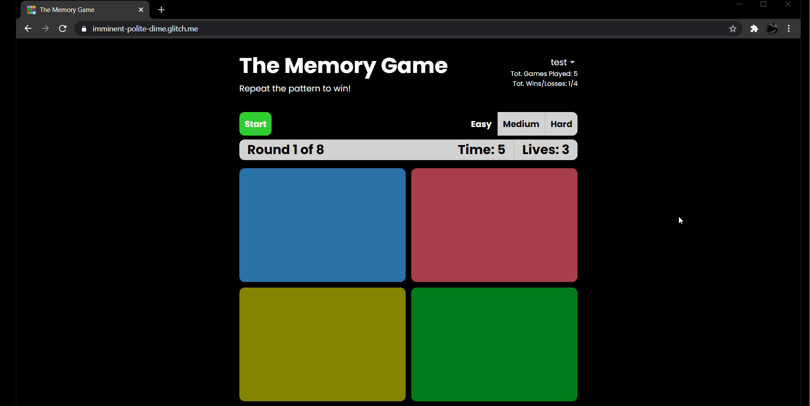

# Pre-work - *The Memory Game*

**The Memory Game** is a Light & Sound Memory game to apply for CodePath's SITE Program. 

Submitted by: Justin Bautista

Time spent: 25 hours spent in total

Link to project: https://glitch.com/edit/#!/imminent-polite-dime

## Required Functionality

The following **required** functionality is complete:

* [x] Game interface has a heading (h1 tag), a line of body text (p tag), and four buttons that match the demo app
* [x] "Start" button toggles between "Start" and "Stop" when clicked. 
* [x] Game buttons each light up and play a sound when clicked. 
* [x] Computer plays back sequence of clues including sound and visual cue for each button
* [x] Play progresses to the next turn (the user gets the next step in the pattern) after a correct guess. 
* [x] User wins the game after guessing a complete pattern
* [x] User loses the game after an incorrect guess

The following **optional** features are implemented:

* [x] Any HTML page elements (including game buttons) has been styled differently than in the tutorial
* [x] Buttons use a pitch (frequency) other than the ones in the tutorial
* [x] More than 4 functional game buttons
* [x] Playback speeds up on each turn
* [x] Computer picks a different pattern each time the game is played
* [x] Player only loses after 3 mistakes (instead of on the first mistake)
* [ ] Game button appearance change goes beyond color (e.g. add an image)
* [ ] Game button sound is more complex than a single tone (e.g. an audio file, a chord, a sequence of multiple tones)
* [x] User has a limited amount of time to enter their guess on each turn

The following **additional** features are implemented:

- [x] Easy, medium, and hard difficulty (increasing total rounds and game buttons depending on difficulty chosen)
- [x] A round counter so player can see how far they got in the game
- [x] Plays an audio file when player makes a mistake
- [x] Plays an audio file when player wins/loses
- [x] Tracks player stats (games played, wins, losses, mistakes, guesses, easy wins, easy losses, etc)
- [x] Anonymously signs in players if they don't have an account
- [x] When anonymous players sign up, their sign-in credentials are linked to their anonymous account so they can keep their stats
- [x] Players can login and sign out of existing accounts  
- [x] Shows an error message if login or sign up credentials are invalid
- [x] Stats update on-screen in real time and are saved to the database after each win/loss
- [x] Players can change their display name
- [x] Persists account until player signs out

## Video Walkthrough

Here's a walkthrough of implemented user stories (some gifs didn't catch when buttons lit up because they were clicked fast):

This is a regular playthrough with the win screen and shows rounds increasing along with playback speed

This shows how a player is given 5 seconds for each guess and loses the game if time runs out 

This shows how a player is allowed 3 mistakes (lives) and loses if a player makes 3 mistakes

This shows the website responsiveness, the difficulty levels, and the start/stop toggle buttons

This shows authentication, persistence, stats, changing display name, and how user data is updated, stored, and displayed 

## Reflection Questions
1. If you used any outside resources to help complete your submission (websites, books, people, etc) list them here. 
    - https://developers.google.com/web/updates/2017/09/autoplay-policy-changes#webaudio
    - https://www.geeksforgeeks.org/javascript-cleartimeout-clearinterval-method/
    - Visual Studio Code
    - Visual Studio Code Live Sass Compiler Extension
    - https://www.youtube.com/playlist?list=PL4cUxeGkcC9jUPIes_B8vRjn1_GaplOPQ
    - https://firebase.google.com/docs

2. What was a challenge you encountered in creating this submission (be specific)? How did you overcome it? (recommended 200 - 400 words) 
        
    A challenge I encountered was implementing the Firebase authentication and the Firestore database. It was a big challenge for me as it was the first time I tried implementing authentication and a database into a website. I started by reading the documentation and watching tutorials online to get a general idea of how it works. Then, I built a simple test website to experiment with the Firebase methods and get hands-on experience before implementing it into my pre-work website. First, I experimented with the basic authentication (creating, logging in, and signing out users) methods and storing the users along with their data into the database. I wanted to use anonymous authentication to allow users to keep track of their stats without having a real account and transfer their stats to a real account once they decided to sign up. To do this, I tried including the anonymous authentication into my test website to see how all the methods would work together. After I felt confident in my understanding, I implemented everything into my pre-work website. Despite my experiments with the test website, I still had problems with the pre-work website as a user with a real account wouldn’t persist after closing the page or after page reloads. Instead of persisting, a new anonymous user would be created. I figured the problem was that the method that created anonymous users, “signInAnonymously()”, was called after every page load. I confirmed my hypothesis by utilizing prints to the console and seeing that “signInAnonymously()” was called first every time the page loaded. After looking over the documentation and tutorials again, I found a method named “onAuthStateChanged()”, which was called every time the user changed; if the user signed in or signed out, this method would be called and return either the current user or null depending on whether there is a user signed in or not. I decided to put the “signInAnonymously()” method into the “onAuthStateChanged()” method so that an anonymous user was created only when no user is signed in. After I solved that issue and a couple of smaller issues, I was able to successfully conquer the challenge of implementing an authentication system and a database into a website.

3. What questions about web development do you have after completing your submission? (recommended 100 - 300 words) 

    I want to know what frameworks or technologies I could use that would’ve made the creation of the pre-work project easier. A lot of the code I wrote could be cleaner and more concise if I used React, Django, or other technologies. I would like to understand why a certain framework or technology would be used for the pre-work project instead of the other and how they work. Other than that, I am curious about how I could have made the authentication and database work more efficiently to improve scalability. I know that if hundreds of users were to use my website simultaneously it wouldn’t work out too well, so I would like to know about better techniques and methods to use that would help the website scale smoothly.  

4. If you had a few more hours to work on this project, what would you spend them doing (for example: refactoring certain functions, adding additional features, etc). Be specific. (recommended 100 - 300 words) 
    
    If I had a few more hours to work on this project, I would create a global leaderboard. For reference, the Firestore data model is a NoSQL, document-oriented database so the database consists of collections (folders) that contain documents (files) that contain data (data within a file). I would achieve the global leaderboard by creating a new collection in the Firestore database called, “leaderboards”, which will hold a document that contains the rankings of the top 50 players based on total wins. So the “leaderboards” collection would hold a document called, “topTotalWins”, which contains 50 user IDs and their total wins. I would update the “topTotalWins” document by comparing a user’s wins against the lowest wins on the document every time a user’s total wins increase. For example, if a user reaches 100 total wins and the lowest total wins in the “topTotalWins” document is 99, then the user with 100 total wins will replace the user with 99 total wins in the “topTotalWins” document. The “topTotalWins” document would be sorted each time a new player enters the leaderboard or a player in the leaderboard increases their wins to make sure the leaderboard is ranked correctly. I could add onto this this by adding other documents to the “leaderboards” collection like “topTotalEasyWins”, “topTotalMediumWins”, and “topTotalHardWins” to give rankings based on win category.

## License

    Copyright [Justin Bautista]

    Licensed under the Apache License, Version 2.0 (the "License");
    you may not use this file except in compliance with the License.
    You may obtain a copy of the License at

        http://www.apache.org/licenses/LICENSE-2.0

    Unless required by applicable law or agreed to in writing, software
    distributed under the License is distributed on an "AS IS" BASIS,
    WITHOUT WARRANTIES OR CONDITIONS OF ANY KIND, either express or implied.
    See the License for the specific language governing permissions and
    limitations under the License.
